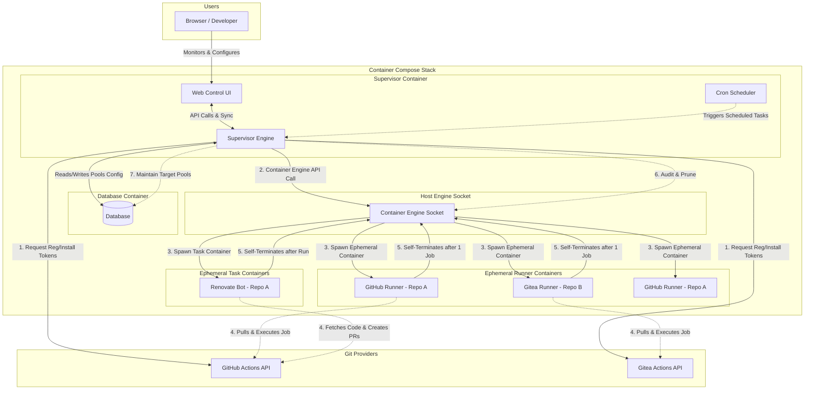

# Architecture Design

This document describes the high-level architecture, directory structure, and core backend abstractions for the GitHub & Gitea Actions Runner AIO Supervisor.

## 1. System Architecture

The following diagram illustrates how the Supervisor manages the lifecycle of ephemeral runner containers and communicates with Git providers and the host container engine.



## 2. Directory & Package Structure (Go Backend)

To support clean architecture and swappable components, the Go-based supervisor daemon is structured as follows:

```text
src/
├── cmd/
│   └── supervisor/         # Go Main entrypoint (CLI parser & daemon runner)
├── internal/
│   ├── config/             # YAML config parser, validation schema
│   ├── db/                 # DB abstraction (SQLite / PG driver, migrations)
│   ├── provider/           # Swappable Git Provider interface
│   │   ├── github/         # GitHub API client & authentication
│   │   └── gitea/          # Gitea API client & authentication
│   ├── orchestrator/       # Swappable ContainerProvider interface
│   │   ├── docker/         # Docker Engine SDK orchestrator implementation
│   │   └── k8s/            # Future: Kubernetes pod orchestrator implementation
│   └── server/             # Embedded Web Server (SSO OAuth, Web Dashboard API)
└── web/                    # Static Web UI build / templates (HTML/JS/CSS)
```

## 3. Abstractions

### 3.1 Orchestration Abstraction

To support multi-environment scalability (e.g., local Compose vs. Kubernetes in the future), container interactions are abstracted via a Go interface:

```go
package orchestrator

import "context"

type RunnerConfig struct {
	Name          string   `json:"name"`
	RepoURL       string   `json:"repo_url"`
	Token         string   `json:"token"`
	Labels        []string `json:"labels"`
	WorkDir       string   `json:"work_dir"`
	Image         string   `json:"image"`
	CPULimit      string   `json:"cpu_limit"`
	MemoryLimit   string   `json:"memory_limit"`
	AllowDocker   bool     `json:"allow_docker"`
}

type RunnerStatus struct {
	ID        string `json:"id"`
	Name      string `json:"name"`
	PoolName  string `json:"pool_name"`
	State     string `json:"state"`
	IPAddress string `json:"ip_address"`
}

type ContainerProvider interface {
	SpawnRunner(ctx context.Context, config RunnerConfig) (string, error)
	SpawnTask(ctx context.Context, config RunnerConfig) (string, error) // For one-off jobs like Renovate
	TerminateRunner(ctx context.Context, containerID string) error
	AuditRunners(ctx context.Context) ([]RunnerStatus, error)
	PruneExitedContainers(ctx context.Context) error
}
```

- **Local Compose Provider (Default)**: Utilizes the official Docker Go SDK via `/var/run/docker.sock` to manage sibling containers.
- **Cluster Provider (Future)**: Uses the Kubernetes `client-go` SDK to spawn runner pods.

### 3.2 Git Provider Abstraction

To decouple the supervisor engine from specific VCS APIs (GitHub vs Gitea), we implement a `GitProvider` interface:

```go
package provider

import "context"

type RegistrationScope string

const (
	ScopeRepo     RegistrationScope = "repo"
	ScopeOrg      RegistrationScope = "org"
	ScopeGlobal   RegistrationScope = "global"
)

type GitProvider interface {
	GetRegistrationToken(ctx context.Context, scope RegistrationScope, targetURL string) (string, error)
	ValidateCredentials(ctx context.Context) error
}
```

## 4. Configuration & Database Sync

The primary method of configuring runner pools and credentials is via the GUI and stored securely in the local database. For GitOps and backup, the supervisor supports YAML Import/Export.

### Schema Definition
```yaml
version: "1.0"

global:
  check_interval_seconds: 10
  default_labels: ["self-hosted", "linux", "dynamic"]

auth_profiles:
  my_github_app:
    auth_method: github_app
    app_id: 123456
    private_key_path: "/run/secrets/gh_app_key.pem"
  my_gitea_token:
    auth_method: gitea_token
    gitea_token_env_var: "SUPERVISOR_GITEA_TOKEN"

pools:
  - name: "frontend-repo-runners"
    provider: github
    repository_url: "https://github.com/my-org/frontend-project"
    auth_profile: "my_github_app"
    min_idle_runners: 2
    max_concurrency: 5
    labels: ["frontend", "node-20"]
    runner_image: "ghcr.io/noosxe/runner-aio:latest"
    allow_docker: false
    max_runner_lifetime_seconds: 7200
    resources:
      cpus: "2.0"
      memory: "4g"
    renovate:
      enabled: true
      cron_schedule: "0 2 * * *" # Run at 2 AM daily
      image: "renovate/renovate:latest"

  - name: "gitea-project-runners"
    provider: gitea
    repository_url: "https://gitea.example.com/my-org/gitea-project"
    auth_profile: "my_gitea_token"
    min_idle_runners: 1
    max_concurrency: 3
    labels: ["backend"]
    runner_image: "ghcr.io/noosxe/runner-aio:latest"
    allow_docker: true
    max_runner_lifetime_seconds: 7200
    resources:
      cpus: "4.0"
      memory: "8g"
```
