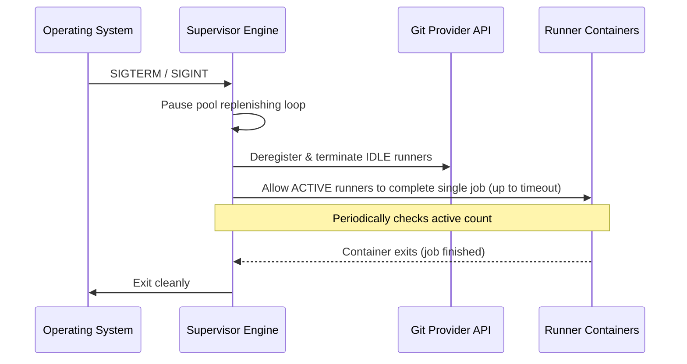

# Lifecycle & Orchestration

This document details the dynamic control loops, state management, and orchestration strategies for the AIO Supervisor.

## 1. Dynamic Ephemeral Lifecycle Control

The supervisor operates a continuous control loop to maintain its ephemeral runner pools:

1. **Boot**: Initializes database connections, loads active runner pool configurations, verifies connection to the host container engine, and validates credentials.
2. **Provisioning**: For each defined pool:
   - Spawns the required number of `min_idle_runners` using the configured runner image.
   - Injects the registration token, repository URL, name, and labels as environment variables.
   - Configures the containers to execute exactly one job and self-terminate.
3. **Monitoring**: Periodically checks the health of running containers.
4. **Replacement (Reaping)**:
   - When an ephemeral runner executes a job, it self-terminates, transitioning the container state to `exited`.
   - The supervisor control loop detects the exited container, removes the dead container, and immediately provisions a fresh idle runner container to restore the target pool count.
5. **Deregistration**: Upon receiving a termination signal, the supervisor executes a Graceful Shutdown.

## 2. Container State Sync & Labeling Strategy

To reconcile the running container state on host restarts or daemon crashes without losing pool references, the supervisor tags every container it provisions with metadata labels:

```ini
com.github-runner-supervisor.managed=true
com.github-runner-supervisor.pool-name=<pool-name>
com.github-runner-supervisor.id=<unique-runner-id>
com.github-runner-supervisor.spawned-at=<timestamp>
```

Upon boot, the supervisor queries the host engine filtering for `com.github-runner-supervisor.managed=true` to dynamically rebuild its in-memory tracking state.

## 3. Real-time Container Audit Engine

While a background polling auditor runs periodically (e.g., every 10 seconds), the Docker provider also listens directly to the Docker Event Stream for real-time reaping:

```go
// Listen for container termination events
messages, errs := cli.Events(ctx, types.EventsOptions{})
```

Upon receiving a `"die"` or `"destroy"` event for a container matching the supervisor labels, the supervisor immediately triggers the provisioning of a replacement runner, keeping pool latency low.

## 4. Target Pool Replenisher & Quota Saturation

- **Replenisher**: Compares the count of active, idle runners for each pool against desired targets. If the active count drops below the target, it schedules new idle containers.
- **Saturation Handling**: When the `Total Allowed Runners` limit is reached, the supervisor queues provisioning requests internally until active containers terminate, preventing host resource depletion.
- **Complete Runner Cleanup (Reaping)**: The supervisor deletes the container write layers and any temporary volumes of exited containers.
- **Hung Runner Auto-Termination**: The supervisor monitors run times and force-terminates any container that exceeds the pool's `max_runner_lifetime_seconds`.

## 5. Managed Renovate Cron Scheduler

For repositories configured with `renovate: enabled: true`, the supervisor extends its lifecycle capabilities beyond listening for runner jobs:
- **Cron Ticking**: The supervisor parses the configured `cron_schedule` and registers it in its internal job ticker.
- **Task Execution**: When the cron fires, the supervisor generates a fresh installation token for the repository (or Gitea/Forgejo instance) and spawns an ephemeral `renovate/renovate` task container instead of a runner container.
- **Self-Termination**: The Renovate container fetches the repo, creates dependency PRs, and exits. The Reaping engine cleans it up identical to runner containers.

## 6. Graceful Image Updates

To ensure environments are kept up-to-date securely:
- **Periodic Update Checks**: The supervisor queries container registries to check if newer versions of the defined `runner_image` are available and alerts the admin in the Web UI.
- **Automatic Background Updates**: Based on a configurable schedule, the supervisor triggers a background image pull.
- **Non-Disruptive Handoff**: Image updates do not disrupt running workflows. Any active runners using the old image are allowed to finish their current job. However, any *newly* provisioned runner container for that pool will instantly use the updated image.

## 7. Graceful Shutdown Protocol

Upon receiving a `SIGTERM` or `SIGINT` termination signal, the daemon executes a structured shutdown to protect active workflow runs:


