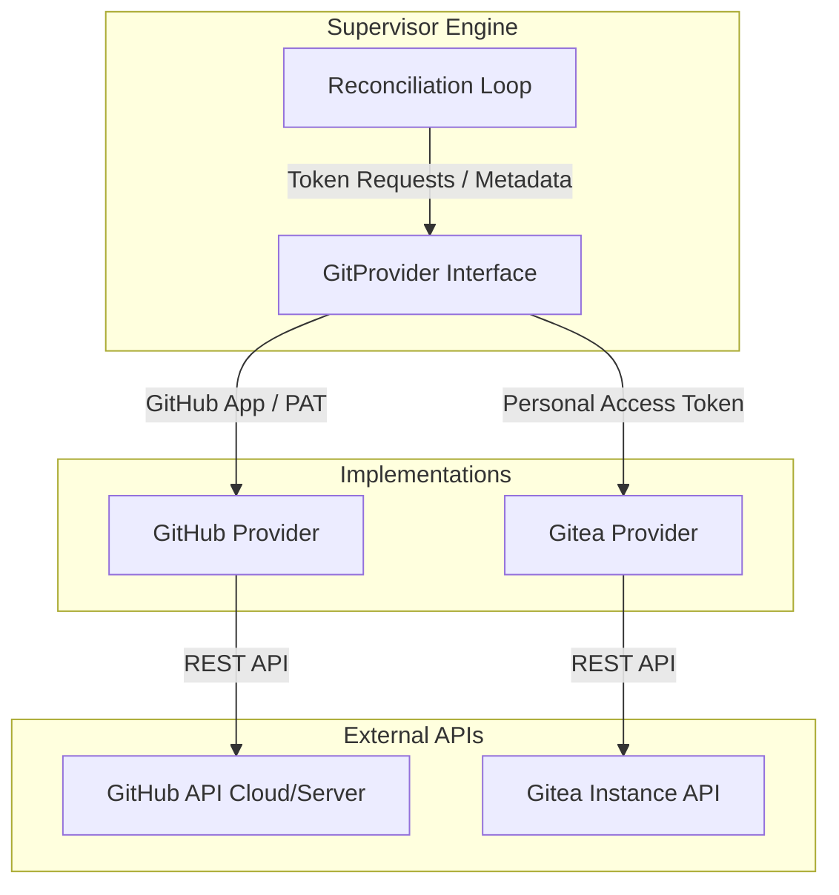

# Technical Design Document: Gitea Action Runner Support

This document outlines the architecture, specifications, and implementation design for extending the **GitHub Actions Runner AIO Supervisor** and the associated container runner to natively support **Gitea Actions** via `act_runner`.

---

## 1. Overview & Goals

Gitea Actions uses `act_runner` (based on `nektos/act`) as its execution agent. While Gitea workflows are highly compatible with GitHub Actions workflow syntax, their daemon lifecycle, registration endpoints, and runner binaries are completely distinct.

### Goals
1. **Unified Runner Container Image**: Extend the existing `Dockerfile` and `entrypoint.sh` to optionally act as a Gitea `act_runner` or GitHub Actions runner, controlled by environment variables. This avoids maintaining separate container images.
2. **Git Provider Abstraction in Go**: Refactor the supervisor daemon backend to abstract the VCS/CI system (GitHub vs Gitea) behind a generic Go interface.
3. **Dynamic Token Registration**: Support Gitea REST APIs to programmatically retrieve runner registration tokens at the repository, organization, and instance level.
4. **Clean Ephemeral Lifecycle**: Ensure Gitea `act_runner` instances execute in ephemeral run-once mode (`GITEA_RUNNER_EPHEMERAL=1`) and cleanly de-register upon termination.

---

## 2. Architecture & Git Provider Abstraction

To support swappable Git hosts, we introduce a new abstraction layer in the supervisor daemon:



### 2.1 GitProvider Interface (`internal/provider/provider.go`)

We will define the following interface to manage token generation and repository metadata:

```go
package provider

import "context"

// RegistrationScope represents the scope of the runner registration (Repo, Org, or Instance/Global)
type RegistrationScope string

const (
	ScopeRepo     RegistrationScope = "repo"
	ScopeOrg      RegistrationScope = "org"
	ScopeGlobal   RegistrationScope = "global"
)

// GitProvider defines the interface that VCS providers (GitHub, Gitea) must implement.
type GitProvider interface {
	// GetRegistrationToken retrieves a short-lived registration token for the target scope
	GetRegistrationToken(ctx context.Context, scope RegistrationScope, targetURL string) (string, error)
	
	// ValidateCredentials checks if the configured credentials are valid and have sufficient access
	ValidateCredentials(ctx context.Context) error
}
```

---

## 3. Database & YAML Configuration Adjustments

To configure and persist Gitea pools, we will update the YAML configuration schema and local database schema.

### 3.1 YAML Configuration (`supervisor.yaml`)

We extend `auth_profiles` and `pools` to support Gitea configurations:

```yaml
version: "1.0"

global:
  check_interval_seconds: 10
  default_labels: ["self-hosted", "linux", "dynamic"]

auth_profiles:
  # GitHub App Profile
  my_github_app:
    auth_method: github_app
    app_id: 123456
    private_key_path: "/run/secrets/gh_app_key.pem"
  
  # Gitea Access Token Profile
  my_gitea_token:
    auth_method: gitea_token
    gitea_token_env_var: "SUPERVISOR_GITEA_TOKEN" # Personal Access Token on Gitea

pools:
  - name: "github-project-pool"
    provider: github # Options: github, gitea
    repository_url: "https://github.com/my-org/frontend-project"
    auth_profile: "my_github_app"
    min_idle_runners: 2
    max_concurrency: 5
    labels: ["frontend", "node-20"]
    runner_image: "ghcr.io/noosxe/runner-aio:latest"

  - name: "gitea-project-pool"
    provider: gitea # Options: github, gitea
    repository_url: "https://gitea.example.com/my-org/backend-project"
    auth_profile: "my_gitea_token"
    min_idle_runners: 1
    max_concurrency: 3
    labels: ["backend", "go-1.22"]
    runner_image: "ghcr.io/noosxe/runner-aio:latest" # Same unified image
    resources:
      cpus: "4.0"
      memory: "8g"
```

### 3.2 Gitea API Integration

The Gitea provider will fetch registration tokens using Gitea REST APIs:

| Level | API Endpoint | Required Permission |
| :--- | :--- | :--- |
| **Instance (Global)** | `POST /api/v1/admin/actions/runners/registration-token` | Gitea Admin Access |
| **Organization** | `POST /api/v1/orgs/{org}/actions/runners/registration-token` | Org Admin Access |
| **Repository** | `POST /api/v1/repos/{owner}/{repo}/actions/runners/registration-token` | Repo Admin Access |

---

## 4. Unified Runner Container Design

The container must house both the GitHub actions runner binaries and the Gitea `act_runner` binary.

### 4.1 Multi-Arch Dockerfile Strategy

In the `Dockerfile`, we will download the correct architecture of the Gitea `act_runner` binary during image build alongside the GitHub runner.

```dockerfile
# Downloader stage for Gitea act_runner
ARG ACT_RUNNER_VERSION=0.2.11
RUN set -ex; \
    if [ "${TARGETARCH}" = "amd64" ] || [ -z "${TARGETARCH}" ]; then \
        GITEA_ARCH="amd64"; \
    elif [ "${TARGETARCH}" = "arm64" ]; then \
        GITEA_ARCH="arm64"; \
    else \
        echo "ERROR: Unsupported Target Architecture: ${TARGETARCH}" >&2; exit 1; \
    fi; \
    curl -o /usr/local/bin/act_runner -L "https://gitea.com/gitea/act_runner/releases/download/v${ACT_RUNNER_VERSION}/act_runner-${ACT_RUNNER_VERSION}-linux-${GITEA_ARCH}"; \
    chmod +x /usr/local/bin/act_runner
```

### 4.2 Entrypoint Orchestration (`src/entrypoint.sh`)

At container runtime, the script determines the mode based on environment variables:

```bash
# Determine provider mode
PROVIDER_MODE="github"
if [ -n "${GITEA_INSTANCE_URL:-}" ] || [ "${RUNNER_PROVIDER:-}" = "gitea" ]; then
    PROVIDER_MODE="gitea"
fi

if [ "$PROVIDER_MODE" = "github" ]; then
    # Execute GitHub Actions runner registration and startup
    ./config.sh --url "${GITHUB_REPOSITORY_URL}" --token "${RUNNER_TOKEN}" ...
    ./run.sh
else
    # Execute Gitea act_runner registration and startup
    export GITEA_RUNNER_EPHEMERAL=1
    
    # Generate act_runner configuration
    act_runner generate-config > /tmp/act_config.yaml
    
    # Register the runner (writes to /actions-runner/.runner)
    act_runner register \
        --no-interactive \
        --instance "${GITEA_INSTANCE_URL}" \
        --token "${RUNNER_TOKEN}" \
        --name "${RUNNER_NAME}" \
        --labels "${RUNNER_LABELS}"
        
    # Start the daemon
    act_runner --config /tmp/act_config.yaml daemon
fi
```

### 4.3 Graceful Deregistration

Upon receiving a teardown signal, Gitea `act_runner` has a cleanup command or deregisters automatically when running in ephemeral mode. We will configure traps in `src/entrypoint.sh` to execute the appropriate deregistration action:

*   For **GitHub**: `./config.sh remove --token "${RUNNER_TOKEN}"`
*   For **Gitea**: `act_runner unregister` or automatic cleanup by Gitea when the ephemeral runner exits.

---

## 5. Security & Isolation Review

> [!IMPORTANT]
> Gitea `act_runner` spawns docker containers on the host (DooD) to run workflow steps. This requires strict security boundaries.

1. **Non-Root Daemon**: The `act_runner` process will execute as the non-root `runner` user inside the container.
2. **Sibling Container Privilege**: Because `act_runner` creates containers on the host, jobs can gain access to host resources if the Gitea repository configures high privileges. The supervisor's `allow_docker` config must control access to `/var/run/docker.sock`.
3. **Credential Segregation**: Gitea Personal Access Tokens (PATs) are kept secure in the supervisor db/environment and never exposed to the runner containers; runner containers only receive short-lived runner registration tokens.
