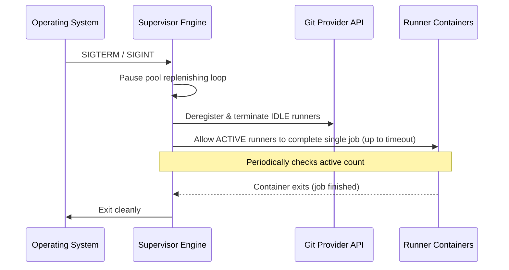

# Technical Design Document: GitHub Actions Runner AIO Supervisor (Stub)

> [!NOTE]
> This is a temporary design stub file containing design-specific implementation plans moved from [requirements.md](file:///workspaces/gh-runner/docs/requirements.md). These details will be refined and completed in the Design Phase.

---

## 1. Directory & Package Structure (Go Backend)

To support clean architecture and swappable components, the Go-based supervisor daemon is structured as follows:

```text
src/
├── cmd/
│   └── supervisor/         # Go Main entrypoint (CLI parser & daemon runner)
├── internal/
│   ├── config/             # YAML config parser, validation schema
│   ├── db/                 # DB abstraction (SQLite / PG driver, migrations)
│   ├── provider/           # Swappable Git Provider interface
│   │   ├── github/         # GitHub API client & authentication
│   │   └── gitea/          # Gitea API client & authentication
│   ├── orchestrator/       # Swappable ContainerProvider interface
│   │   ├── docker/         # Docker Engine SDK orchestrator implementation
│   │   └── k8s/            # Future: Kubernetes pod orchestrator implementation
│   └── server/             # Embedded Web Server (SSO OAuth, Web Dashboard API)
└── web/                    # Static Web UI build / templates (HTML/JS/CSS)
```

---

## 2. Orchestration Abstraction

To support multi-environment scalability (Docker Compose locally and Kubernetes Pods in production), the daemon abstracts all container interactions behind a Go interface:

```go
package orchestrator

import "context"

// RunnerConfig defines the parameters required to spin up a single runner instance.
type RunnerConfig struct {
	Name          string            `json:"name"`
	RepoURL       string            `json:"repo_url"`
	Token         string            `json:"token"`
	Labels        []string          `json:"labels"`
	WorkDir       string            `json:"work_dir"`
	Image         string            `json:"image"`
	CPULimit      string            `json:"cpu_limit"`
	MemoryLimit   string            `json:"memory_limit"`
	AllowDocker   bool              `json:"allow_docker"`
}

// RunnerStatus represents the state of a runner instance in the underlying orchestrator.
type RunnerStatus struct {
	ID        string `json:"id"`
	Name      string `json:"name"`
	PoolName  string `json:"pool_name"`
	State     string `json:"state"` // e.g. "running", "exited", "created"
	IPAddress string `json:"ip_address"`
}

// ContainerProvider defines the interface that orchestrator backends must implement.
type ContainerProvider interface {
	SpawnRunner(ctx context.Context, config RunnerConfig) (string, error)
	TerminateRunner(ctx context.Context, containerID string) error
	AuditRunners(ctx context.Context) ([]RunnerStatus, error)
	PruneExitedContainers(ctx context.Context) error
}
```

### 2.1 Docker Compose Provider (Default)
Utilizes the official Docker Go SDK connecting via `/var/run/docker.sock` to control sibling containers on the same host.

### 2.2 Kubernetes Provider (Future)
Connects via the Kubernetes `client-go` SDK to spawn runners as ephemeral Pods inside a target namespace.

---

## 3. Container State Sync & Labeling Strategy

To reconcile the running container state on host restarts or daemon crashes without losing pool references, the supervisor tags every container it provisions with metadata labels:

```ini
com.github-runner-supervisor.managed=true
com.github-runner-supervisor.pool-name=<pool-name>
com.github-runner-supervisor.id=<unique-runner-id>
com.github-runner-supervisor.spawned-at=<timestamp>
```

Upon boot, the supervisor queries the host engine filtering for `com.github-runner-supervisor.managed=true` to dynamically rebuild its in-memory tracking state.

---

## 4. Real-time Container Audit Engine

While a background polling auditor runs periodically (e.g., every 10 seconds), the Docker provider also listens directly to the Docker Event Stream for real-time reaping:

```go
// Listen for container termination events
messages, errs := cli.Events(ctx, types.EventsOptions{})
```

Upon receiving a `"die"` or `"destroy"` event for a container matching the supervisor labels, the supervisor immediately triggers the provisioning of a replacement runner, keeping pool latency low.

---

## 5. Graceful Shutdown Protocol

Upon receiving a `SIGTERM` or `SIGINT` termination signal, the daemon executes a structured shutdown to protect active workflow runs:



---

## 6. Git Provider Abstraction Definition

To decouple the supervisor engine from specific VCS APIs, we implement a `GitProvider` interface as detailed in [design_gitea_support.md](file:///home/mechsoull/Projects/gh-runner/docs/design_gitea_support.md). This allows the core pool reconciliation engine to remain entirely provider-agnostic. All token retrieval and credentials validation are routed through this interface depending on the configured `provider` in `supervisor.yaml`.
