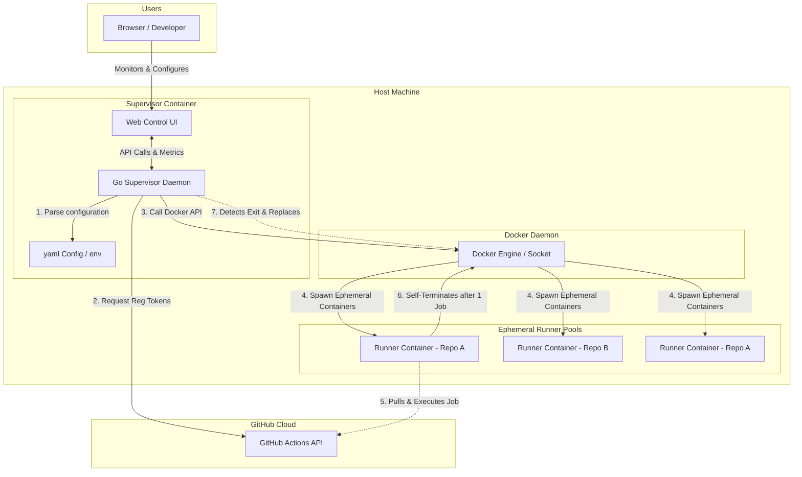

# High-Level Requirements & Specifications: GitHub Actions Runner AIO Supervisor

This document outlines the high-level specifications and architectural design for the **GitHub Actions Runner All-In-One (AIO) Supervisor**. The supervisor is a containerized management service that automates the orchestration, registration, and scaling of multiple **ephemeral, self-hosted GitHub Actions runners** across arbitrary GitHub repositories on a single host.

---

## 1. Executive Summary & Goals

### The Problem
Traditional self-hosted runner setups involve running persistent runner processes. This poses major security and maintenance challenges:
1. **State Persistence**: Successive jobs run in the same container, leading to directory clutter, leftover processes, and potential cross-job data leakage.
2. **Dashboard Clutter**: Static runners that go offline are marked as "offline ghost runners" on GitHub, cluttering repository and organization settings.
3. **Scaling Limitations**: Orchestrating runners across multiple repositories or scaling runner capacity dynamically requires complex custom scripting or heavy-weight orchestration tools like Kubernetes (Actions Runner Controller).

### The Solution: AIO Supervisor
The **AIO Supervisor** is a single, lightweight container running an optimized **Go (Golang)** daemon with an embedded **Web Control Interface**. It acts as an on-host control plane that:
- **Maintains Dynamic Ephemeral Pools**: Configured to run ephemeral containers (using the `--ephemeral` flag), ensuring each runner container executes **exactly one job** and self-destructs immediately.
- **Provides Multi-Repository Support**: Simultaneously manages independent runner pools for different GitHub repositories from a single host.
- **Provides a GitHub App SSO & Setup Flow**: Features a guided onboarding wizard to configure repository pools and authenticates users securely via GitHub OAuth.
- **Provides a Web Control Interface**: Serves a secure web UI to monitor pool states, search execution history, check success/failure statistics, analyze queue wait-time latency, and view real-time logs.
- **Ensures Graceful Lifecycles**: Monitors runner lifetimes, dynamically obtains fresh registration tokens from the GitHub API, replaces terminated containers, and cleanly de-registers them during supervisor shutdown.
- **Implements Secure-by-Default Isolation**: Enforces CPU/Memory constraints, runs under non-root contexts, and isolates credentials.

---

## 2. System Architecture

The following diagram illustrates how the Supervisor manages the lifecycle of ephemeral runner containers and communicates with GitHub and the host Docker engine.



---

## 3. Functional Requirements

### 3.1 Declarative Configuration Schema
The supervisor daemon will parse a YAML file (e.g., `supervisor.yaml`) to declare the target repositories, pool sizes, and specific constraints. 

```yaml
version: "1.0"

# Global settings for the supervisor
global:
  check_interval_seconds: 10          # Frequency of container health checks
  default_labels: ["self-hosted", "linux", "dynamic"]

# Authentication Profiles
auth_profiles:
  my_github_app:
    auth_method: github_app
    app_id: 123456
    private_key_path: "/run/secrets/gh_app_key.pem"
  my_pat_auth:
    auth_method: pat
    pat_env_var: "SUPERVISOR_GITHUB_PAT"

# Runner Pools Definitions
pools:
  - name: "frontend-repo-runners"
    repository_url: "https://github.com/my-org/frontend-project"
    auth_profile: "my_github_app"
    min_idle_runners: 2
    max_concurrency: 5
    labels: ["frontend", "node-20"]
    runner_image: "ghcr.io/noosxe/gh-runner:latest"
    resources:
      cpus: "2.0"
      memory: "4g"

  - name: "backend-repo-runners"
    repository_url: "https://github.com/my-org/backend-project"
    auth_profile: "my_pat_auth"
    min_idle_runners: 1
    max_concurrency: 3
    labels: ["backend", "go-1.22"]
    runner_image: "ghcr.io/noosxe/gh-runner:latest"
    resources:
      cpus: "4.0"
      memory: "8g"
```

### 3.2 Authentication Flows
Since GitHub runner registration tokens expire after **1 hour**, a long-running supervisor cannot rely on static tokens. It must authenticate dynamically using one of two methods:

#### A. GitHub App Integration (Recommended)
1. The supervisor loads the private key (`.pem`) and App ID.
2. It generates a JSON Web Token (JWT) signed with the private key.
3. It requests an installation token for the target repository from the GitHub API.
4. Using this temporary installation token, it requests a fresh Runner Registration Token.

#### B. Personal Access Token (PAT) Fallback
1. The supervisor reads the PAT from a secure environment variable.
2. It directly calls the GitHub Actions registration API to retrieve a fresh Runner Registration Token for the target repository.

### 3.3 Dynamic Ephemeral Lifecycle Control
The supervisor operates a continuous control loop:
1. **Boot**: Reads the configuration file, verifies connection to the Docker engine via `/var/run/docker.sock`, and validates credentials.
2. **Provisioning**: For each defined pool:
   - Spawns the required number of `min_idle_runners` using the configured runner image.
   - Inject the registration token, repository URL, name, and labels as environment variables.
   - Run containers with the `--ephemeral` flag configured.
3. **Monitoring**: Periodically checks the health of running containers.
4. **Replacement (Reaping)**:
   - When an ephemeral runner executes a job, it self-terminates, transitioning the container state to `exited` (exit code `0`).
   - The supervisor control loop detects the exited container, removes the dead container, and immediately provisions a fresh idle runner container to restore the target pool count.
5. **Deregistration**: Upon receiving a termination signal (`SIGTERM` or `SIGINT`), the supervisor halts the control loop and gracefully terminates all running runner containers, waiting for active jobs to complete (up to a timeout) or invoking deregistration APIs.

### 3.4 User Authentication & GitHub App Integration
To simplify multi-tenant and multi-repository administration, the supervisor operates as an integrated **GitHub App** and supports OAuth-based Single Sign-On (SSO):

1. **User Authentication (SSO)**:
   - When users visit the homepage (e.g., `https://supervisor.example.com`), they are prompted to log in/sign up via their GitHub account.
   - The supervisor uses standard GitHub OAuth2 protocol to authenticate the user and obtain a secure session.
2. **Installation Mapping**:
   - The supervisor retrieves the GitHub App installations that the authenticated user has access to.
   - This determines which repositories and organizations the user is authorized to manage and monitor inside the dashboard.

### 3.5 Interactive Onboarding & Setup Flow
For new installations or initial configurations, the supervisor serves a guided, multi-step onboarding setup flow:

- **Step 1: Choose Repositories & Organizations**:
  - The UI lists all GitHub Organizations and Repositories where the supervisor's GitHub App is installed.
  - The user checks the specific repositories or organizations they want to onboard for dynamic runner pooling.
- **Step 2: Choose Global Scaling Constraints**:
  - Configures global runner thresholds, including:
    - **Total Allowed Runners**: Absolute maximum number of runner containers executing concurrently across all pools to prevent resource exhaustion.
    - **Total Idle Warm Pool**: The global default count of idle runner containers kept running in a warm state to pick up queued jobs instantly.
- **Step 3: Define Custom Per-Repo / Per-Org Constraints (Optional)**:
  - Users can optionally override global settings on a granular level:
    - Specific pool sizes (`min_idle_runners`, `max_concurrency`) per repository.
    - Custom runner labels (e.g., `node-20`, `go-1.22`, `heavy-gpu`).
    - CPU and Memory hard limits (Docker resource quotas) per repository pool.
- **Step 4: Review & Confirmation**:
  - Summarizes the planned configuration pools, expected system footprints, and credential setups.
  - Upon user confirmation, the supervisor starts the control loops and dynamic pool provisioning instantly.

### 3.6 Embedded Administration & Web Dashboard
Following configuration, users are redirected to their persistent Web Dashboard containing advanced monitoring:

- **Active Dynamic Pools**:
  - Visual status of each runner pool, listing active container instances, CPU/Memory resource consumption, uptime, and runner name.
- **Job Run Analytics & History**:
  - **Recent Run List**: Displays details of recently executed actions jobs, with full search, filtering, and pagination capabilities.
  - **Streaming Logs**: Live logs of individual active runners streaming using WebSockets.
- **Success & Failure Stats**:
  - Displays health and performance aggregates of jobs (success/failure ratio, counts, runtimes).
- **Queue Wait Time Analytics**:
  - *Calculation*: The supervisor hooks into GitHub's webhook events (specifically `workflow_job.queued` and `workflow_job.started`).
  - *Formula*: It calculates the queue latency as `started_at` - `queued_at` (the precise duration a job waited in GitHub's queue before being picked up by one of our ephemeral runner containers).
  - *Visual Output*: Graphs the average queue wait time over hours/days, indicating system capacity health and whether additional warm idle runners should be provisioned to decrease latency.
- **Security Boundaries**:
  - Enforces secure HTTP cookies, anti-CSRF tokens, and TLS encryption (HTTPS).
  - Web UI can run locally or be exposed securely behind a reverse proxy.

---

## 4. Non-Functional & Security Requirements

To adhere to strict security guardrails, the supervisor and dynamic runners must incorporate the following isolation features:

### 4.1 Security Isolation
- **Non-Root Context**: Runner containers spawned by the supervisor must continue to execute jobs under the dedicated low-privilege system user (`runner` UID `1001`), as defined in the base `Dockerfile`.
- **Credential Segregation**: Registration tokens must be generated on-the-fly and passed strictly via environment variables to individual containers. The private keys/PATs used by the supervisor must **never** be shared with or mounted into the ephemeral runner containers.
- **Resource Quotas**: Every pool must allow specifying CPU and memory boundaries (e.g., `cpus: "2.0"`, `memory: "4g"`) to prevent an individual rogue workflow from consuming all host system resources and causing a denial of service.

### 4.2 Platform & Architecture Support
- **Multi-Architecture Support**: The supervisor container and dynamic runner images must support **ARM64** and **AMD64** architectures out-of-the-box, ensuring seamless execution on M-series Apple Silicon, AWS Graviton instances, and traditional Intel/AMD servers.

---

## 5. Development Phases

```text
  Phase 1: Design (Current)  -->  Phase 2: Go Daemon & Web UI     -->  Phase 3: Webhook Integrations
  • Requirements & Schema         • Static pool scaling             • Real-time webhook scaling
  • Threat & Security review      • Embedded Web UI & Dashboard     • Dynamic scale-to-zero
                                  • App & PAT auth engine
```

### Phase 2: Core Go Daemon & Web UI
In the next phase, we will implement the supervisor as a native, lightweight Go application capable of:
1. Parsing the `supervisor.yaml` configuration.
2. Obtaining registration tokens dynamically using App ID or PAT.
3. Interacting with the Docker engine API to start, stop, and clean up ephemeral containers.
4. Maintaining stable pools of dynamic runners.
5. Serving the embedded Web Control Interface to allow visual administration, logging, and metrics.

### Phase 3: Webhook & Autoscaling (Optional Extension)
Extend the supervisor with an HTTP receiver for GitHub Webhooks (`workflow_job.queued` and `workflow_job.completed`). This allows scaling the pool down to zero when no jobs are active, and dynamically spinning up runners specifically to match queued jobs.
