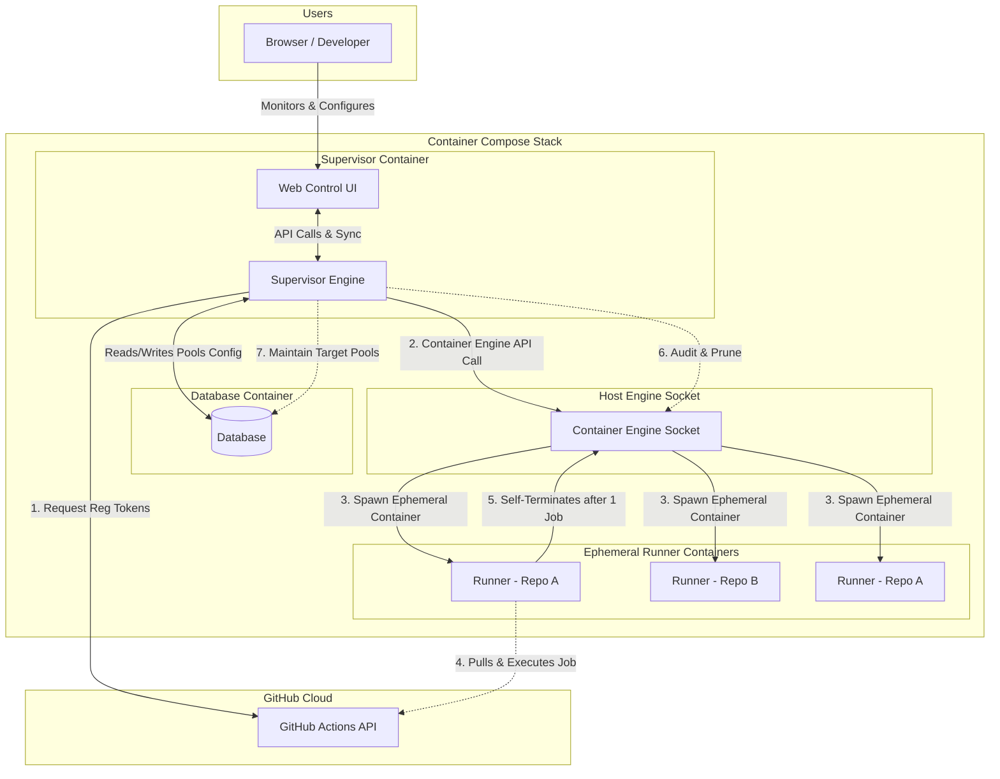

# High-Level Requirements & Specifications: GitHub Actions Runner AIO Supervisor

This document outlines the high-level specifications and product requirements for the **GitHub Actions Runner All-In-One (AIO) Supervisor**. The supervisor is a containerized management service that automates the orchestration, registration, and scaling of multiple **ephemeral, self-hosted GitHub Actions runners** across arbitrary GitHub repositories on a single host.

---

## 1. Executive Summary & Goals

### The Problem
Traditional self-hosted runner setups involve running persistent runner processes. This poses major security and maintenance challenges:
1. **State Persistence**: Successive jobs run in the same container, leading to directory clutter, leftover processes, and potential cross-job data leakage.
2. **Dashboard Clutter**: Static runners that go offline are marked as "offline ghost runners" on GitHub, cluttering repository and organization settings.
3. **Scaling Limitations**: Orchestrating runners across multiple repositories or scaling runner capacity dynamically requires complex custom scripting or heavy-weight orchestration tools like Kubernetes (Actions Runner Controller).

### The Solution: AIO Supervisor
The **AIO Supervisor** is a containerized daemon and web control plane. It manages dynamic, on-demand pools of ephemeral runners by auditing container processes and responding directly to GitHub events.

Key capabilities:
- **Containerized Daemon Deployment**: Runs inside its own dedicated container alongside a local database, communicating with the host container engine via its socket interface.
- **Maintains Dynamic Ephemeral Pools**: Configured to run ephemeral containers, ensuring each runner container executes **exactly one job** and self-destructs immediately.
- **Database-Driven Target Configuration**: Continuously queries the active database to ensure the configured count of "ready and waiting" idle runners is maintained per user, organization, or repository.
- **Provides Multi-Repository Support**: Simultaneously manages independent runner pools for different GitHub repositories and organizations from a single host.
- **Provides a GitHub App SSO & Setup Flow**: Features a guided onboarding wizard to configure repository pools and authenticates users securely via GitHub OAuth.
- **Provides a Web Control Interface**: Serves a secure web UI to monitor pool states, search execution history, check success/failure statistics, analyze queue wait-time latency, and view real-time logs.
- **Ensures Graceful Lifecycles**: Monitors runner lifetimes, dynamically obtains fresh registration tokens from the GitHub API, replaces terminated containers, and cleanly de-registers them during supervisor shutdown.
- **Implements Secure-by-Default Isolation**: Enforces CPU/Memory constraints, runs under non-root contexts, isolates credentials, and restricts host Docker socket access.

---

## 2. System Architecture

The following diagram illustrates how the Supervisor manages the lifecycle of ephemeral runner containers and communicates with GitHub and the host container engine.



### 2.2 Orchestration Abstraction (Future-Proofing)
To support future scalability beyond standalone container compose hosts (e.g., deploying to cluster-based container engines), the supervisor's orchestration layer must remain abstracted:
- **Local Compose Provider (Default)**: Connects to the local container engine socket (e.g., `/var/run/docker.sock`) to control sibling containers on the same host.
- **Cluster Provider (Future)**: Connects to a cluster orchestration API (e.g., Kubernetes client SDK) to spawn runners as ephemeral Pods inside a target namespace.

---

## 3. Functional Requirements

### 3.1 GUI & Database-Driven Configuration (with Import/Export)

The primary method of configuring runner pools, credentials, and scaling constraints is interactive, managed directly through the Web Control UI (GUI) and stored securely in the local database.

To support GitOps workflows, backups, migration, and automation, the supervisor also provides an API and a UI action to **Import** and **Export** the active configurations in a standardized YAML format.

The following schema defines the structure for YAML configuration imports and exports:

```yaml
version: "1.0"

# Global settings for the supervisor
global:
  check_interval_seconds: 10          # Frequency of container health checks
  default_labels: ["self-hosted", "linux", "dynamic"]

# Authentication Profiles
auth_profiles:
  my_github_app:
    auth_method: github_app
    app_id: 123456
    private_key_path: "/run/secrets/gh_app_key.pem"
  my_pat_auth:
    auth_method: pat
    pat_env_var: "SUPERVISOR_GITHUB_PAT"

# Runner Pools Definitions
pools:
  - name: "frontend-repo-runners"
    repository_url: "https://github.com/my-org/frontend-project"
    auth_profile: "my_github_app"
    min_idle_runners: 2
    max_concurrency: 5
    labels: ["frontend", "node-20"]
    runner_image: "ghcr.io/noosxe/gh-runner:latest"
    allow_docker: false                # Configurable Docker socket access
    max_runner_lifetime_seconds: 7200  # Max runtime for hung runners
    resources:
      cpus: "2.0"
      memory: "4g"

  - name: "backend-repo-runners"
    repository_url: "https://github.com/my-org/backend-project"
    auth_profile: "my_pat_auth"
    min_idle_runners: 1
    max_concurrency: 3
    labels: ["backend", "go-1.22"]
    runner_image: "ghcr.io/noosxe/gh-runner:latest"
    allow_docker: true                 # Mounts host Docker socket for Docker-in-Docker workflows
    max_runner_lifetime_seconds: 7200
    resources:
      cpus: "4.0"
      memory: "8g"
```

### 3.2 Authentication Flows
Since GitHub runner registration tokens expire after **1 hour**, a long-running supervisor cannot rely on static tokens. It must authenticate dynamically using one of two methods:

#### A. GitHub App Integration (Recommended)
1. The supervisor loads the private key (`.pem`) and App ID.
2. It generates a signed JSON Web Token (JWT).
3. It requests an installation token for the target repository from the GitHub API.
4. Using this temporary installation token, it requests a fresh Runner Registration Token.

#### B. Personal Access Token (PAT) Fallback
1. The supervisor reads the PAT from a secure environment variable.
2. It directly calls the GitHub Actions registration API to retrieve a fresh Runner Registration Token for the target repository.

### 3.3 Dynamic Ephemeral Lifecycle Control
The supervisor operates a continuous control loop:
1. **Boot**: Initializes database connections, loads active runner pool configurations from the database, verifies connection to the host container engine, and validates credentials.
2. **Provisioning**: For each defined pool:
   - Spawns the required number of `min_idle_runners` using the configured runner image.
   - Injects the registration token, repository URL, name, and labels as environment variables.
   - Configures the containers to execute exactly one job and self-terminate.
3. **Monitoring**: Periodically checks the health of running containers.
4. **Replacement (Reaping)**:
   - When an ephemeral runner executes a job, it self-terminates, transitioning the container state to `exited`.
   - The supervisor control loop detects the exited container, removes the dead container, and immediately provisions a fresh idle runner container to restore the target pool count.
5. **Deregistration**: Upon receiving a termination signal (`SIGTERM` or `SIGINT`), the supervisor executes a **Graceful Shutdown**:
   - Halts all further provisioning loops.
   - Deregisters and stops all currently idle runner containers.
   - Allows active runner containers to complete their running job, up to a configurable shutdown timeout.
   - Cleans up and exits once all containers have stopped.

### 3.4 User Authentication & GitHub App Integration
To simplify multi-tenant and multi-repository administration, the supervisor operates as an integrated **GitHub App** and supports OAuth-based Single Sign-On (SSO):

1. **User Authentication (SSO)**:
   - When users visit the homepage, they are prompted to log in via their GitHub account.
   - The supervisor uses the standard GitHub OAuth2 protocol to authenticate the user and obtain a secure session.
2. **Installation Mapping**:
   - The supervisor retrieves the GitHub App installations that the authenticated user has access to.
   - This determines which repositories and organizations the user is authorized to manage and monitor inside the dashboard.
3. **App Least Privilege Scopes**:
   - The supervisor's GitHub App must request the minimum necessary scopes:
     - `Actions` (Read/Write) to request runner registration tokens.
     - `Metadata` and `Administration` (Read-Only) to retrieve repository/organization list details.

### 3.5 Interactive Onboarding & Setup Flow
For new installations or initial configurations, the supervisor serves a guided, multi-step onboarding setup flow:

- **Step 1: Choose Repositories & Organizations**:
  - The UI lists all GitHub Organizations and Repositories where the supervisor's GitHub App is installed.
  - The user checks the specific repositories or organizations they want to onboard for dynamic runner pooling.
- **Step 2: Choose Global Scaling Constraints**:
  - Configures global runner thresholds, including:
    - **Total Allowed Runners**: Absolute maximum number of runner containers executing concurrently across all pools to prevent resource exhaustion.
    - **Total Idle Warm Pool**: The global default count of idle runner containers kept running in a warm state to pick up queued jobs instantly.
- **Step 3: Define Custom Per-Repo / Per-Org Constraints (Optional)**:
  - Users can optionally override global settings on a granular level:
    - Specific pool sizes (`min_idle_runners`, `max_concurrency`) per repository.
    - Custom runner labels.
    - CPU and Memory hard limits per repository pool.
- **Step 4: Review & Confirmation**:
  - Summarizes the planned configuration pools, expected system footprints, and credential setups.
  - Upon user confirmation, the supervisor starts the control loops and dynamic pool provisioning instantly.

### 3.6 Embedded Administration & Web Dashboard
Following configuration, users are redirected to their persistent Web Dashboard containing advanced monitoring:

- **Active Dynamic Pools**:
  - Visual status of each runner pool, listing active container instances, CPU/Memory resource consumption, uptime, and runner name.
- **Job Run Analytics & History**:
  - **Recent Run List**: Displays details of recently executed Actions jobs, with full search, filtering, and pagination capabilities.
  - **Streaming Logs**: Live logs of individual active runners.
  - **Data Retention**: The supervisor must enforce a configurable metrics and history retention window (default: 30 days) to automatically prune older logs and database records.
- **Success & Failure Stats**:
  - Displays health and performance aggregates of jobs (success/failure ratio, counts, runtimes).
- **Queue Wait Time Analytics**:
  - *Calculation*: The supervisor hooks into GitHub's webhook events (specifically `workflow_job.queued` and `workflow_job.started`).
  - *Formula*: It calculates the queue latency as `started_at` - `queued_at` (the precise duration a job waited in GitHub's queue before being picked up by one of our ephemeral runner containers).
  - *Visual Output*: Graphs the average queue wait time over hours/days, indicating system capacity health and whether additional warm idle runners should be provisioned to decrease latency.
- **Security Boundaries**:
  - Enforces secure HTTP cookies, anti-CSRF tokens, and TLS encryption (HTTPS).
  - Web UI can run locally or be exposed securely behind a reverse proxy.

### 3.7 Core Supervisor Engine
The supervisor daemon is responsible for pool alignment, container scheduling, lifecycle orchestration, and dynamic cleaning:

1. **Orchestrator Architecture**:
   - The supervisor runs containerized, managing sibling runner containers.
   - Abstractions are established to allow scaling to cluster-level orchestration in the future.
2. **Persistence State Sync**:
   - Holds configuration inside a persistent database.
   - Tracks configurations at the User, Organization, and Repository levels.
   - Reconciles the configured state (pool sizes, resource quotas) with actual running containers.
3. **Dual Trigger Mechanism**:
   - **Real-time Event Listener**: Receives notifications of new jobs (e.g., via GitHub webhooks or events) to provision runners instantly and minimize latency.
   - **Continuous Auditor Loop**: A periodic background check that inspects runner container states to detect exited containers, update tracking states, and replace missing/dead runners to maintain pool target counts.
4. **Target Pool Replenisher & Quota Saturation**:
   - Compares the count of active, idle runners for each pool against the desired targets.
   - If the active count drops below the target (e.g. because a runner is executing a job or has exited), it schedules new idle containers to restore coverage.
   - **Saturation Handling**: When the `Total Allowed Runners` limit is reached, the supervisor must queue provisioning requests internally until active containers terminate, preventing host resource depletion.
5. **Complete Runner Cleanup (Reaping)**:
   - Runner containers exit immediately after completing exactly one job.
   - The supervisor detects this exit, deletes the container write layers and any temporary volumes, ensuring complete cleanliness.
   - **Hung Runner Auto-Termination**: The supervisor must monitor run times and force-terminate any container that exceeds the pool's `max_runner_lifetime_seconds` to prevent hung jobs from blocking the pool indefinitely.

---

## 4. Non-Functional & Security Requirements

To adhere to strict security guardrails, the supervisor and dynamic runners must incorporate the following isolation features:

### 4.1 Security Isolation
- **Non-Root Context**: Runner containers spawned by the supervisor must continue to execute jobs under the dedicated low-privilege system user (`runner` UID `1001`), as defined in the base `Dockerfile`.
- **Credential Segregation**: Registration tokens must be generated on-the-fly and passed strictly via environment variables to individual containers. The private keys/PATs used by the supervisor must **never** be shared with or mounted into the ephemeral runner containers.
- **Resource Quotas**: Every pool must allow specifying CPU and memory boundaries (e.g., `cpus: "2.0"`, `memory: "4g"`) to prevent an individual rogue workflow from consuming all host system resources and causing a denial of service.
- **Docker Socket Isolation (DooD Safety)**: The system must enforce configurable Docker socket isolation. The host Docker socket must *not* be mounted into runner containers unless explicitly allowed in the pool's configuration (via `allow_docker: true`).
- **Configuration & Database Security**: Sensitive credentials stored in the database must be encrypted at rest (e.g., using AES-256 with an encryption key provided via a supervisor environment variable).
- **Safe Export/Import Sanitization**: Exporting configurations via YAML must sanitize or redact raw credentials (such as raw private keys or PATs), using placeholders or reference keys to prevent accidental credential leakage into version control.

### 4.2 Platform & Architecture Support
- **Multi-Architecture Support**: The supervisor container and dynamic runner images must support **ARM64** and **AMD64** architectures out-of-the-box, ensuring seamless execution on M-series Apple Silicon, AWS Graviton instances, and traditional Intel/AMD servers.

### 4.3 Provisioning Latency SLA
- **Provisioning Speed**: Under normal host loads, the supervisor must provision and register a new runner container within 5 seconds of an event trigger (web event or container exit detection).

---

## 5. Development Phases

```text
  Phase 1: Design (Current)  -->  Phase 2: Supervisor Daemon & Web UI  -->  Phase 3: Webhook Integrations
  • Requirements & Schema         • Static pool scaling                • Real-time webhook scaling
  • Threat & Security review      • Embedded Web UI & Dashboard        • Dynamic scale-to-zero
                                  • App & PAT auth engine
```

### Phase 2: Core Supervisor Daemon & Web UI
In the next phase, we will implement the supervisor as a native, lightweight application capable of:
1. Initializing from database configurations and supporting `supervisor.yaml` import/export.
2. Obtaining registration tokens dynamically using App ID or PAT.
3. Interacting with the container engine API to start, stop, and clean up ephemeral containers.
4. Maintaining stable pools of dynamic runners.
5. Serving the embedded Web Control Interface to allow visual administration, logging, and metrics.

### Phase 3: Webhook & Autoscaling (Optional Extension)
Extend the supervisor with an HTTP receiver for GitHub Webhooks (`workflow_job.queued` and `workflow_job.completed`). This allows scaling the pool down to zero when no jobs are active, and dynamically spinning up runners specifically to match queued jobs.
